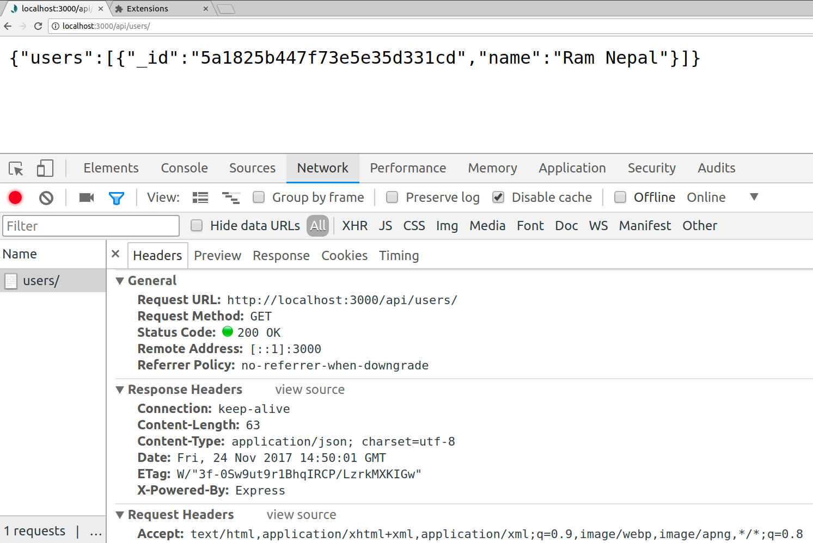

# API

* Create a file **user.api.routes.js** inside **routers** folder and use require it in **app.js**
  ```
  app.use('/api/users', require('./routes/user.api.routes'));
  ```
  `/api/users` is written instead of `/`, to add `/api/users` as prefix to all the routes created inside the file

* Create **/api/users** get routes to list all user in json form
  ```
  const express = require('express');
  const app = express.Router();
  
  const User = require('../models/users');
  
  // List users
  app.get('/', (req, res) => {
    User.find({})
      .select('name')
      .then(users => {
        res.send({users: users});
      })
      .catch((err) => {
        res.statusCode = 400;
        res.end(err.message);
      });
  });
  
  module.exports = app;
  ```
* open routes, [http://localhost:3000/api/users](http://localhost:3000/api/users)

  
  
  Response header has **Content-Type:application/json**
  